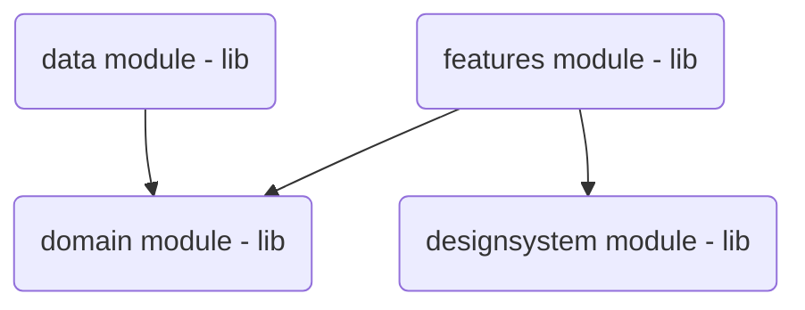

# Picontest

Picontest is a social network app. The aim of the app is to provide to users a place to share their photography's talent.

## Concept

During the week, users can take photos from the app. At the end of the week, they received a notification to start the contest.
Then they can choose one of the photo taken during the last week. Finally, they have to rate 10 random other user's photo.

## Architecture

Modularized kotlin android application based on Clean architecture principles : 
- Dependency injection : performed with [Koin](https://insert-koin.io/)
- Dependency inversion to make domain module centric
- Managing unidirectional data flow & SSOT 
- Applying single responsibility principle

### UI Design Pattern

Chosen UI design pattern is [MVVM](https://developer.android.com/topic/libraries/architecture/viewmodel?hl=fr) to fit last requirements from Android and recommended pattern.

### Gradle

Only gradle kotlin DSL 
All libs and versions in `gradle/libs.versions.toml`

## UI

I decided to do UI part with [Jetpack Compose](https://developer.android.com/jetpack/compose?hl=fr) because it offers powerful tools to implement beautiful UI with less and comprehensive code.

### Material3

Theme is designed with [Material3](https://m3.material.io) lib
